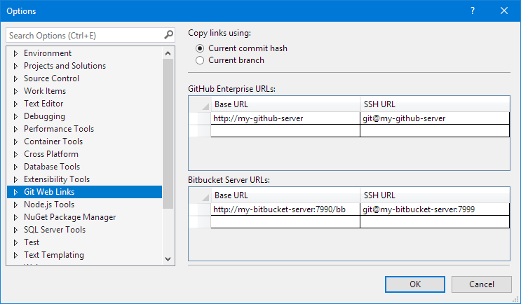

# Git Web Links

Copy links to files in their online Git repositories from inside Visual Studio 2017.

Works with GitHub, GitHub Enterprise, Bitbucket Server and Bitbucket Cloud.

:information_source: For GitHub Enterprise and Bitbucket Server, there is some configuration required. [See below for more details](#github-enterprise-and-bitbucket-server).

## Copy Link to File

To copy a link to the file on GitHub (or Bitbucket), right-click on the file's tab and select _Copy Link to GitHub_.

## Copy Link to Selection

To copy a link to a particular line in the file, right-click on the line in the editor and select _Copy Link to GitHub_.

If you want to copy a link to a range of lines, just select the lines first.

## Copy Link to File in Solution Explorer

You can also copy a link to a file or folder from Solution Explorer.

## GitHub Enterprise and Bitbucket Server

If you use GitHub Enterprise or Bitbucket Server, you will need to tell this extension the URLs of those servers. To do that, go to _Tools -> Options -> Git Web Links_.

You will need to specify the base URL of the server. If you use SSH remote URLs, then you will also need to specify the SSH URL.

## Troubleshooting

### It creates a link to the wrong repository

The extension uses your repository's remote URLs to determine what the URL to the website should be. If your repository has multiple remotes, and there is an `origin` remote, that remote is used. If you don't have an `origin` remote, then the first remote, alphabetically, is used.
